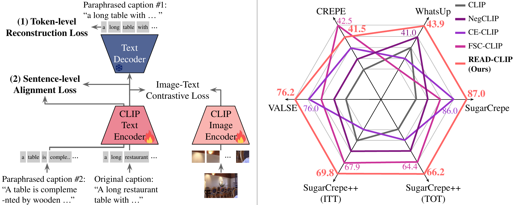

# READ-CLIP

**REconstruction and Alignment of text Descriptions for Compositional Reasoning in CLIP**

[](https://arxiv.org/abs/2510.16540)
[](https://jih00nkw0n.github.io/READ-CLIP/)
[](https://openreview.net/forum?id=6uKIm4bfEe)
[](https://huggingface.co/Mayfull/READ-CLIP)
[](LICENSE)
[](https://pytorch.org)

READ-CLIP is a lightweight fine-tuning recipe that plugs a **frozen text decoder** into CLIP and adds two auxiliary
losses—**token-level reconstruction** and **sentence-level alignment**—to unlock state-of-the-art compositional
reasoning.  
Trained on only **100 k MS-COCO samples**, READ-CLIP (ViT-B/32) tops five standard benchmarks, beating strong baselines
such as NegCLIP and FSC-CLIP by up to **4.5 pp**.

At inference time, READ-CLIP is a drop-in `transformers.CLIPModel`: **no decoder, no extra inference module, and the
same CLIP-style image-text scoring API**.



---

## Table of Contents

1. [Quick Start](#quick-start-sample-inference)
2. [Why READ-CLIP?](#why-read-clip)
3. [Installation & Usage (Docker Recommended)](#installation--usage-docker-recommended)
4. [Training](#advanced-entering-a-shell-inside-docker)
5. [Experiments & Results](#experiments--results)
6. [Reproducing the Paper](#reproducing-the-paper)
7. [Pre-trained Checkpoints](#pre-trained-checkpoints)
8. [Expected Compute & Determinism](#expected-compute--determinism)
9. [Citation](#citation)
10. [License](#license)

---

## Quick Start [Sample Inference]

```bash
# 1. create env (Python ≥3.8, PyTorch ≥2.1)
conda create -n readclip python=3.10 -y && conda activate readclip
pip install -r requirements.txt

# 2. rank a positive caption against a compositionally wrong caption
python example.py
```

Expected output:

```text
Device: cuda
Image: http://images.cocodataset.org/val2014/COCO_val2014_000000391895.jpg

Ranked captions:
1. positive | score=...
   A man with a red helmet is riding a small moped on a dirt road.
2. negative | score=...
   A small moped with a red helmet is riding a man on a dirt road.
```

---

## Why READ-CLIP?

READ-CLIP is designed for researchers who need a compositional CLIP model without changing the deployment path:

| Method | Main signal | Extra inference cost | What READ-CLIP adds |
|--------|-------------|----------------------|---------------------|
| NegCLIP | Rule-based hard negatives | No | Stronger text-side compositional encoding |
| FSC-CLIP | Token-patch calibration | No | Complementary reconstruction/alignment losses |
| TripletCLIP | Synthetic negative images and captions | No | Lightweight 100 k COCO fine-tuning instead of large pretraining |
| **READ-CLIP** | Text reconstruction + paraphrase alignment | **No** | Drop-in CLIP model with SOTA average accuracy |

Use READ-CLIP when you want:

- A Hugging Face `CLIPModel` checkpoint for compositional image-text scoring.
- A fine-tuning recipe that targets the CLIP text encoder bottleneck.
- Reproducible results on SugarCrepe, SugarCrepe++, WhatsUp, CREPE, and VALSE.

---

## Installation & Usage (Docker Recommended)

Everything can be run in Docker — no Python installation or CUDA drivers on the host required (except for the NVIDIA
driver).

<details>
<summary><strong>Step 1. Build the Docker image</strong></summary>

```bash
docker build -t read-clip .
```

</details>

<details>
<summary><strong>Step 2. Training</strong></summary>

```bash
bash script/run_docker.sh --train --wandb-key YOUR-WANDB-KEY
```

- All necessary data, output, and logs directories will be mounted for persistence.
- `YOUR-WANDB-KEY` is optional; if omitted, W&B logging will be disabled.

</details>

<details>
<summary><strong>Step 3. Evaluation</strong></summary>

```bash
bash script/run_docker.sh --eval
```

</details>

---

### Advanced: Entering a Shell Inside Docker

If you want to run custom scripts or debug:

```bash
bash script/run_docker.sh
```

Then, inside the container:

```bash
source /venv/bin/activate
bash setup.sh
# Now you can run anything, e.g.
python train.py --cfg-path config/train_read_clip.yaml
```

---

> **Tip:**  
> For convenient mode switching (`train`/`eval`/`shell`), use the provided [run_docker.sh](./script/run_docker.sh) launcher:
> ```bash
> bash script/run_docker.sh --train --wandb-key YOUR-WANDB-KEY      # for training
> bash script/run_docker.sh --eval                                  # for evaluation
> bash script/run_docker.sh                                         # just get a shell
> ```

---

## Experiments & Results

Key hyper-parameters (defined in the YAML):

| name               | value  | note   |
|--------------------|--------|--------|
| `learning_rate`    | `1e-5` | AdamW  |
| `weight_decay`     | `1e-1` |        |
| `num_train_epochs` | `5`    |        |
| `batch_size`       | `256`  | global |
| `bf16`             | `true` | A100   |


## Reproducing the Paper

> ```bash
> bash script/run_docker.sh --train --wandb-key YOUR-WANDB-KEY      # for training
> ```

```bash
bash script/run_docker.sh --eval
```

| Benchmark          | Metric | READ-CLIP | NegCLIP | FSC-CLIP |
|--------------------|--------|-----------|---------|----------|
| WhatsUp            | Acc.   | **43.9**  | 42.4    | 39.8     |
| VALSE              | Acc.   | **76.2**  | 73.7    | 74.4     |
| CREPE              | Acc.   | **41.5**  | 30.5    | 42.5     |
| SugarCrepe         | Acc.   | **87.0**  | 83.6    | 85.2     |
| SugarCrepe++ (ITT) | Acc.   | **69.8**  | 65.0    | 67.9     |
| SugarCrepe++ (TOT) | Acc.   | **66.2**  | 62.5    | 64.4     |
| **Average**        | Acc.   | **64.1**  | 59.6    | 62.4     |

Numbers reproduce Table 1 in the paper.

---

## Pre-trained Checkpoints

| model              | link                                                    |
|--------------------|---------------------------------------------------------|
| READ-CLIP ViT-B/32 | [Checkpoint](https://huggingface.co/Mayfull/READ-CLIP). |

The checkpoint can be loaded directly with:

```python
from transformers import CLIPModel, CLIPProcessor

model = CLIPModel.from_pretrained("Mayfull/READ-CLIP")
processor = CLIPProcessor.from_pretrained("openai/clip-vit-base-patch32")
```

---

## Expected Compute & Determinism

* All results are obtained on **one NVIDIA A100 40 GB** GPU.
* Training READ-CLIP ViT-B/32 (5 epochs, 256 batch) takes **≈2 GPU‑hours**.
* We fix `torch`, `numpy`, and `random` seeds to `2025` for determinism.

---

## Citation

If READ-CLIP is useful for your research, please cite:

```bibtex
@inproceedings{kwon2025readclip,
  title = {Enhancing Compositional Reasoning in CLIP via Reconstruction and Alignment of Text Descriptions},
  author = {Kwon, Jihoon and Min, Kyle and Sohn, Jy-yong},
  booktitle = {Advances in Neural Information Processing Systems},
  year = {2025}
}
```

---

## License

Released under the **MIT License**—see [`LICENSE`](LICENSE).

---

<sub>Last updated · 2026-06-11</sub>
